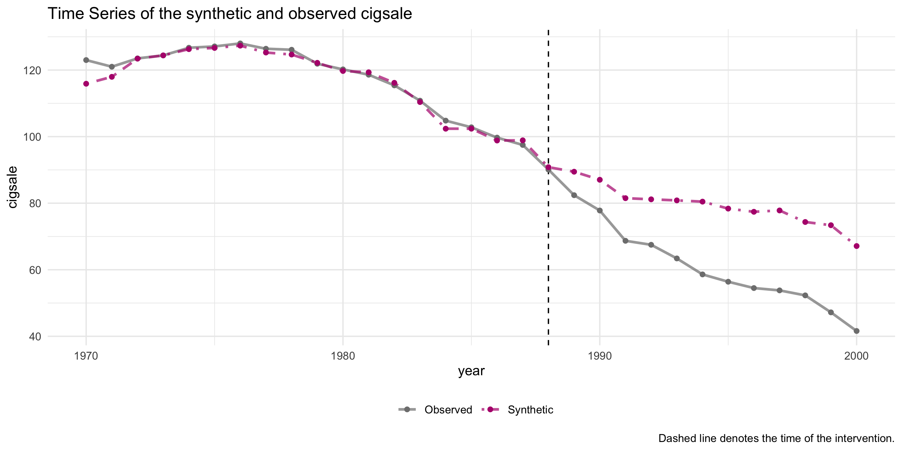
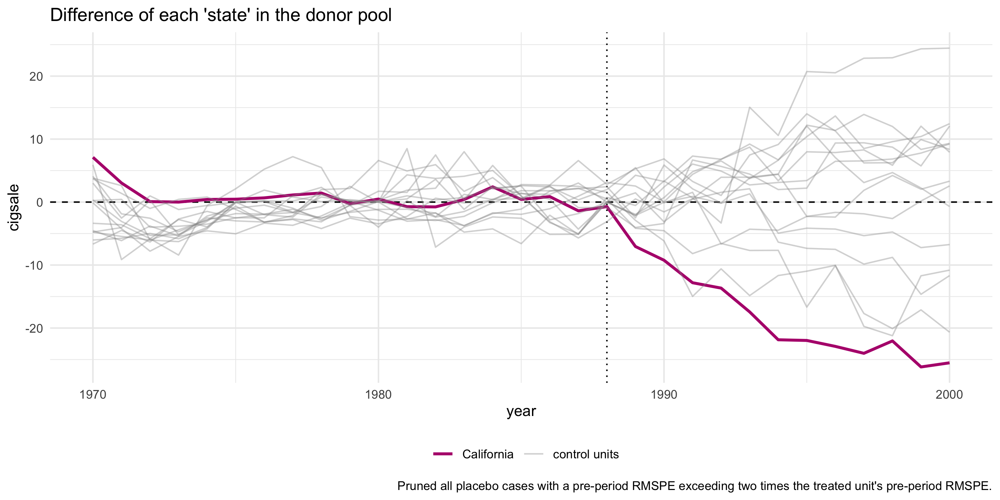

# tidysynth

## Overview

`tidysynth` offers a tidy implementation the synthetic control method
(see Abadie et al. 2003, 2010, 2015). Building on [prior
packages](https://cran.r-project.org/web/packages/Synth/Synth.pdf),
`tidysynth` makes a number of needed improvements when implementing the
method in `R`. Increasing the user’s capacity to inspect, visualize, and
tune the synthetic control.

The packages makes the following improvements:

  - generates placebo synthetic controls on the fly allowing one to
    generate inferential statistics and plots without needing to write
    further code;
  - offers plotting methods to easily explore the fit of the synthetic
    control and weights;
  - relies on a nested tidy data structure with `grab_` prefix function
    to easily extract different aspects of the pipeline used to generate
    the synthetic control, increasing usability.

## Installation

``` r
# Install the developer version from Github
# install.packages("devtools")
devtools::install_github("tidyverse/ggplot2")
```

## Usage

The package uses pipeline of functions to generate the synthetic
control.

|        Function        | Description                                                                                                                                                     |
| :--------------------: | :-------------------------------------------------------------------------------------------------------------------------------------------------------------- |
| `synthetic_control()`  | Initialize a `synth_tbl`. The main initialization function of the `tidysynth` method.                                                                           |
| `generate_predictor()` | Create one or more scalar variables summarizing covariate data across a specified time window. These predictor variables are used to fit the synthetic control. |
|  `generate_weigths()`  | fits the unit and predictor weights used to generate the synthetic control.                                                                                     |
|  `generate_control()`  | generates the synthetic control using the optimized weights.                                                                                                    |

The following example comes from Abadie et. al 2010, which evaluates the
impact of Proposition 99 on cigarette consumption in California.
Proposition 99 greatly increased funding to anti-smoking campaigns and
imposed a 25 cent tax on a pack og cigarettes

``` r
require(tidysynth)
data("smoking")
smoking %>% dplyr::glimpse()
```

    ## Rows: 1,209
    ## Columns: 7
    ## $ state     <chr> "Rhode Island", "Tennessee", "Indiana", "Nevada", "Louisian…
    ## $ year      <dbl> 1970, 1970, 1970, 1970, 1970, 1970, 1970, 1970, 1970, 1970,…
    ## $ cigsale   <dbl> 123.9, 99.8, 134.6, 189.5, 115.9, 108.4, 265.7, 93.8, 100.3…
    ## $ lnincome  <dbl> NA, NA, NA, NA, NA, NA, NA, NA, NA, NA, NA, NA, NA, NA, NA,…
    ## $ beer      <dbl> NA, NA, NA, NA, NA, NA, NA, NA, NA, NA, NA, NA, NA, NA, NA,…
    ## $ age15to24 <dbl> 0.1831579, 0.1780438, 0.1765159, 0.1615542, 0.1851852, 0.17…
    ## $ retprice  <dbl> 39.3, 39.9, 30.6, 38.9, 34.3, 38.4, 31.4, 37.3, 36.7, 28.8,…

Let’s generate a synthetic California using information from the “donor
pool”, which is composed of control states where a law like Proposition
99 wasn’t implemented. This is the pool of potential cases from which we
borrow information when fitting to the observed California in the
pre-intervention period.

``` r
smoking_out <-
  
  smoking %>%
  
  # initial the synthetic control object
  synthetic_control(outcome = cigsale, # what variable are we generating the synthetic control for?
                    unit = state, # Unit index in the panel data
                    time = year, # Time index in the panel data
                    i_unit = "California", # Name of the unit where the intervention occurred
                    i_time = 1988, # time period when the intervention occurred
                    generate_placebos=T # generate placebo synthetic controls as well
                    ) %>%
  
  # Generate the aggregate predictors used to fit the weights
  generate_predictor(time_window=1980:1988,
                     ln_income = mean(lnincome, na.rm = T),
                     ret_price = mean(retprice, na.rm = T),
                     youth = mean(age15to24, na.rm = T)) %>%
  
  # What was the averate beer consumption in the donor pool from 1984 - 1988
  generate_predictor(time_window=1984:1988,
                     beer_sales = mean(beer, na.rm = T)) %>%
  
  # Lagged cigarette sales
  generate_predictor(time_window=1975,
                     cigsale_1975 = cigsale) %>%
  generate_predictor(time_window=1980,
                     cigsale_1980 = cigsale) %>%
  generate_predictor(time_window=1988,
                     cigsale_1988 = cigsale) %>%
  
  
  # Generate the fitted weights for the synthetic control
  generate_weights(optimization_window =1970:1988, # Can set the time window in the 
                   Margin.ipop=.02,Sigf.ipop=7,Bound.ipop=6) %>%
  
  # Generate the synthetic control
  generate_control()
```

Once the synthetic control is generated, one can easily assess the
fit…

``` r
smoking_out %>% plot_trends()
```



…and the post-intervention period difference, which reflects the causal
effect (i.e. the difference between the observed and
counterfactual).

``` r
smoking_out %>% plot_differences()
```


In addition, one can easily examine the weighting of the units and
variables in the fit. This allows one to see which cases were used, in
part, to generate the synthetic
control

``` r
smoking_out %>% plot_weights()
```


Another useful way of evaluating the synthetic control is to look at how
comparable the control is to the covariates of the actual fit.

``` r
smoking_out %>% grab_balance_table()
```

    ## # A tibble: 7 x 4
    ##   variable     California synthetic_California donor_sample
    ##   <chr>             <dbl>                <dbl>        <dbl>
    ## 1 ln_income        10.1                  9.84         9.83 
    ## 2 ret_price        89.4                 89.4         87.3  
    ## 3 youth             0.174                0.174        0.173
    ## 4 beer_sales       24.3                 24.3         23.7  
    ## 5 cigsale_1975    127.                 127.         137.   
    ## 6 cigsale_1980    120.                 120.         138.   
    ## 7 cigsale_1988     90.1                 90.8        114.

### Inference

The method relies on generating placebo synthetic controls for every
donor in the donor pool exactly as was done for California. By setting
`generate_placebos = TRUE` when initializing the `synth_tbl` with
`synthetic_control()`, placebo cases are generated alongside the target
unit, where the intervention actually took place. The aim is then to
compare the behavior between the target difference and the placebo
differences.

``` r
smoking_out %>% plot_placebos()
```



Note that the `plot_placebos()` function automatically prunes placebo
synthetic controls that poorly fit and throw off the scale when plotting
the placebos. To prune, the function looks at the pre-intervention
period mean squared prediction error (MSPE) (i.e. a metric that reflects
how well the synthetic control maps to the observed outcome time
series). If a placebo control has a MSPE that is two times beyond the
target case, then it’s dropped. To turn off this behavior, set `prune =
FALSE`.

``` r
smoking_out %>% plot_placebos(prune=F)
```


Finally, Adabie et al. 2010 outline a way of constructing Fisher’s Exact
P-value but taking dividing the post-intervention period MSPE by the
pre-intervention period MSPE and then ranking all the cases by this
ratio. The p-value is the constructed by taking the rank/total.\[1\] The
idea is that if the synthetic control fits the observed time series well
(low MSPE in the pre-period) and diverges in the post-period (high MSPE
in the post-period) then there is a meaningful effect due to the
intervention. Put differently, a good fit in the pre-period means we’ve
generate a descent mapping of the cases behavior. If the intervention
had no effect, then the post-period and pre-period should continue to
map onto one another fairly well.

This ratio can be easily plotted, offering insight into the rarity of
the case where the intervention actually occurred. Here one can see that
California is a clear
outlier.

``` r
smoking_out %>% plot_mspe_ratio()
```


For most specific information, there is a significance table that can be
extracted with one of the many `grab_` prefix functions.

``` r
smoking_out %>% grab_signficance()
```

    ## # A tibble: 39 x 8
    ##    unit_name  type  pre_mspe post_mspe mspe_ratio  rank fishers_exact_p… z_score
    ##    <chr>      <chr>    <dbl>     <dbl>      <dbl> <int>            <dbl>   <dbl>
    ##  1 California Trea…     3.94     390.       99.0      1           0.0256  5.13  
    ##  2 Georgia    Donor     3.48     174.       49.8      2           0.0513  2.33  
    ##  3 Virginia   Donor     5.86     171.       29.2      3           0.0769  1.16  
    ##  4 Indiana    Donor    18.4      415.       22.6      4           0.103   0.787 
    ##  5 West Virg… Donor    14.3      287.       20.1      5           0.128   0.646 
    ##  6 Connectic… Donor    27.3      335.       12.3      6           0.154   0.202 
    ##  7 Nebraska   Donor     6.47      54.3       8.40     7           0.179  -0.0189
    ##  8 Missouri   Donor     9.19      77.0       8.38     8           0.205  -0.0199
    ##  9 Texas      Donor    24.5      160.        6.54     9           0.231  -0.125 
    ## 10 Idaho      Donor    53.2      340.        6.39    10           0.256  -0.133 
    ## # … with 29 more rows

### Accessing Data

In addition, to the main data pipeline for generating the synthetic
control and the `plot_` prefix functions for visualizing the output,
there are also a number of `grab_` prefix functions that allow one
easily to grab the data contained within a `synth_tbl` object.

Note that at its core, a `synth_tbl` is just a nested tibble data frame,
where each component of the synthetic control pipeline is appended on as
each function is run.

``` r
smoking_out
```

    ## # A tibble: 78 x 11
    ##    .id   .placebo .type .outcome .predictors .synthetic_cont… .unit_weights
    ##    <chr>    <dbl> <chr> <list>   <list>      <list>           <list>       
    ##  1 Cali…        0 trea… <tibble… <tibble [7… <tibble [31 × 3… <tibble [38 …
    ##  2 Cali…        0 cont… <tibble… <tibble [7… <tibble [31 × 3… <tibble [38 …
    ##  3 Rhod…        1 trea… <tibble… <tibble [7… <tibble [31 × 3… <tibble [38 …
    ##  4 Rhod…        1 cont… <tibble… <tibble [7… <tibble [31 × 3… <tibble [38 …
    ##  5 Tenn…        1 trea… <tibble… <tibble [7… <tibble [31 × 3… <tibble [38 …
    ##  6 Tenn…        1 cont… <tibble… <tibble [7… <tibble [31 × 3… <tibble [38 …
    ##  7 Indi…        1 trea… <tibble… <tibble [7… <tibble [31 × 3… <tibble [38 …
    ##  8 Indi…        1 cont… <tibble… <tibble [7… <tibble [31 × 3… <tibble [38 …
    ##  9 Neva…        1 trea… <tibble… <tibble [7… <tibble [31 × 3… <tibble [38 …
    ## 10 Neva…        1 cont… <tibble… <tibble [7… <tibble [31 × 3… <tibble [38 …
    ## # … with 68 more rows, and 4 more variables: .predictor_weights <list>,
    ## #   .original_data <list>, .meta <list>, .loss <list>

To make it easier to access the relevant data fields (as writing out the
relevant unnesting procedure can get involved), the `grab_` prefix
functions come into
play.

|          Function          | Description                                                                                                                                        |
| :------------------------: | :------------------------------------------------------------------------------------------------------------------------------------------------- |
|      `grab_outcome()`      | Extract the outcome variable generated by `synthetic_control()`.                                                                                   |
|    `grab_predictors()`     | Extract the aggregate-level covariates generated by `generate_predictor()`.                                                                        |
|   `grab_unit_weights()`    | Extract the unit weights generated by `generate_weights()`.                                                                                        |
| `grab_predictor_weights()` | Extract the predictor variable weights generated by `generate_weights()`.                                                                          |
|       `grab_loss()`        | Extract the RMSE loss of the optimized weights generated by `generate_weights()`.                                                                  |
| `grab_synthetic_control()` | Extract the synthetic control generated using `generate_control()`.                                                                                |
|    `grab_signficance()`    | Generate inferential statistics comparing the rarity of the unit that actually received the intervention to the placebo units in the donor pool.   |
|   `grab_balance_table()`   | Compare the distributions of the aggregate-level predictors for the observed intervention unit, the synthetic control, and the donor pool average. |

``` r
smoking_out %>% grab_synthetic_control()
```

    ## # A tibble: 31 x 3
    ##    time_unit real_y synth_y
    ##        <dbl>  <dbl>   <dbl>
    ##  1      1970   123     116.
    ##  2      1971   121     118.
    ##  3      1972   124.    123.
    ##  4      1973   124.    124.
    ##  5      1974   127.    126.
    ##  6      1975   127.    127.
    ##  7      1976   128     127.
    ##  8      1977   126.    125.
    ##  9      1978   126.    125.
    ## 10      1979   122.    122.
    ## # … with 21 more rows

Note that most all the `grab_` functions allow for extraction of the
placebo units as well.

``` r
smoking_out %>% grab_synthetic_control(placebo=T)
```

    ## # A tibble: 1,209 x 5
    ##    .id        .placebo time_unit real_y synth_y
    ##    <chr>         <dbl>     <dbl>  <dbl>   <dbl>
    ##  1 California        0      1970   123     116.
    ##  2 California        0      1971   121     118.
    ##  3 California        0      1972   124.    123.
    ##  4 California        0      1973   124.    124.
    ##  5 California        0      1974   127.    126.
    ##  6 California        0      1975   127.    127.
    ##  7 California        0      1976   128     127.
    ##  8 California        0      1977   126.    125.
    ##  9 California        0      1978   126.    125.
    ## 10 California        0      1979   122.    122.
    ## # … with 1,199 more rows

1.  Note this implies that you’d need at least 20 cases in the donor
    pool to get a conventional p-value (.05).
