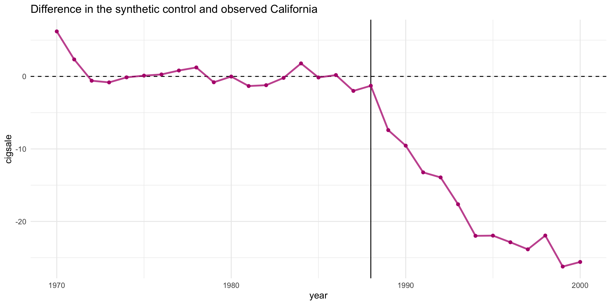

# tidysynth 

<br>

## Overview

`tidysynth` is a tidy implementation the [synthetic control
method](https://en.wikipedia.org/wiki/Synthetic_control_method) in `R`.
A synthetic control offers a way of evaluating the effect of an
intervention in comparative case studies. The method aims to model a
counterfactual unit using a weighted average of units that did not
receive the intervention. The effect of the intervention can be
estimated by comparing differences in the observed and synthetic time
series. See Abadie et
al. [2003](https://www.aeaweb.org/articles?id=10.1257/000282803321455188),
[2010](https://economics.mit.edu/files/11859),
[2015](https://onlinelibrary.wiley.com/doi/abs/10.1111/ajps.12116) for
more on the method and use cases.

Building on the
[`Synth`](https://cran.r-project.org/web/packages/Synth/Synth.pdf)
package, `tidysynth` makes a number of improvements when implementing
the method in `R`. These improvements allow users to inspect, visualize,
and tune the synthetic control more easily. A key benefit of a tidy
implementation is that the entire preparation process for building the
synthetic control can be accomplished in a single pipe.

Specifically, the package:

  - generates placebo synthetic controls on the fly allowing for
    inferential statistics;
  - offers plotting methods to easily explore the fit of the synthetic
    control and weights;
  - increases transparency and usability through a pipe-able
    implementation;
  - relies on a nested tidy data structure with `grab_` prefix functions
    to easily extract component elements from synthetic control
    pipeline.

## Installation

``` r
# install.packages("devtools")
devtools::install_github("edunford/tidysynth")
```

## Usage

The package uses a pipeline of functions to generate the synthetic
control.

| Function               | Description                                                                                                                                                     |
| :--------------------- | :-------------------------------------------------------------------------------------------------------------------------------------------------------------- |
| `synthetic_control()`  | Initialize a synth pipeline by specifying the panel series, outcome, and intervention period. This pipeline operates as a nested `tbl_df`                       |
| `generate_predictor()` | Create one or more scalar variables summarizing covariate data across a specified time window. These predictor variables are used to fit the synthetic control. |
| `generate_weights()`   | Fit the unit and predictor weights used to generate the synthetic control.                                                                                      |
| `generate_control()`   | Generate the synthetic control using the optimized weights.                                                                                                     |

The following example comes from [Abadie et
al. 2010](https://economics.mit.edu/files/11859), which evaluates the
impact of Proposition 99 on cigarette consumption in California.

``` r
require(tidysynth)
data("smoking")
smoking %>% dplyr::glimpse()
```

    ## Rows: 1,209
    ## Columns: 7
    ## $ state     <chr> "Rhode Island", "Tennessee", "Indiana", "Nevada", "Louisian…
    ## $ year      <dbl> 1970, 1970, 1970, 1970, 1970, 1970, 1970, 1970, 1970, 1970,…
    ## $ cigsale   <dbl> 123.9, 99.8, 134.6, 189.5, 115.9, 108.4, 265.7, 93.8, 100.3…
    ## $ lnincome  <dbl> NA, NA, NA, NA, NA, NA, NA, NA, NA, NA, NA, NA, NA, NA, NA,…
    ## $ beer      <dbl> NA, NA, NA, NA, NA, NA, NA, NA, NA, NA, NA, NA, NA, NA, NA,…
    ## $ age15to24 <dbl> 0.1831579, 0.1780438, 0.1765159, 0.1615542, 0.1851852, 0.17…
    ## $ retprice  <dbl> 39.3, 39.9, 30.6, 38.9, 34.3, 38.4, 31.4, 37.3, 36.7, 28.8,…

The method aims to generate a synthetic California using information
from a subset of control states (the “donor pool”) where a similar law
was *not* implemented. The donor pool is the subset of case comparisons
from which information is borrowed to generate a synthetic version of
the treated unit (“California”).

``` r
smoking_out <-
  
  smoking %>%
  
  # initial the synthetic control object
  synthetic_control(outcome = cigsale, # outcome
                    unit = state, # unit index in the panel data
                    time = year, # time index in the panel data
                    i_unit = "California", # unit where the intervention occurred
                    i_time = 1988, # time period when the intervention occurred
                    generate_placebos=T # generate placebo synthetic controls (for inference)
                    ) %>%
  
  # Generate the aggregate predictors used to fit the weights
  
  # average log income, retail price of cigarettes, and proportion of the
  # population between 15 and 24 years of age from 1980 - 1988
  generate_predictor(time_window = 1980:1988,
                     ln_income = mean(lnincome, na.rm = T),
                     ret_price = mean(retprice, na.rm = T),
                     youth = mean(age15to24, na.rm = T)) %>%
  
  # average beer consumption in the donor pool from 1984 - 1988
  generate_predictor(time_window = 1984:1988,
                     beer_sales = mean(beer, na.rm = T)) %>%
  
  # Lagged cigarette sales 
  generate_predictor(time_window = 1975,
                     cigsale_1975 = cigsale) %>%
  generate_predictor(time_window = 1980,
                     cigsale_1980 = cigsale) %>%
  generate_predictor(time_window = 1988,
                     cigsale_1988 = cigsale) %>%
  
  
  # Generate the fitted weights for the synthetic control
  generate_weights(optimization_window = 1970:1988, # time to use in the optimization task
                   margin_ipop = .02,sigf_ipop = 7,bound_ipop = 6 # optimizer options
  ) %>%
  
  # Generate the synthetic control
  generate_control()
```

Once the synthetic control is generated, one can easily assess the fit
by comparing the trends of the synthetic and observed time series. The
idea is that the trends in the pre-intervention period should map
closely onto one another.

``` r
smoking_out %>% plot_trends()
```


To capture the causal quantity (i.e. the difference between the observed
and counterfactual), one can plot the differences using
`plot_differences()`

``` r
smoking_out %>% plot_differences()
```


In addition, one can easily examine the weighting of the units and
variables in the fit. This allows one to see which cases were used, in
part, to generate the synthetic control.

``` r
smoking_out %>% plot_weights()
```



Another useful way of evaluating the synthetic control is to look at how
comparable the synthetic control is to the observed covariates of the
treated unit.

``` r
smoking_out %>% grab_balance_table()
```

    ## # A tibble: 7 x 4
    ##   variable     California synthetic_California donor_sample
    ##   <chr>             <dbl>                <dbl>        <dbl>
    ## 1 ln_income        10.1                  9.84         9.83 
    ## 2 ret_price        89.4                 89.4         87.3  
    ## 3 youth             0.174                0.174        0.173
    ## 4 beer_sales       24.3                 24.3         23.7  
    ## 5 cigsale_1975    127.                 127.         137.   
    ## 6 cigsale_1980    120.                 120.         138.   
    ## 7 cigsale_1988     90.1                 90.8        114.

### Inference

For inference, the method relies on repeating the method for every donor
in the donor pool exactly as was done for the treated unit —
i.e. generating *placebo* synthetic controls). By setting
`generate_placebos = TRUE` when initializing the synth pipeline with
`synthetic_control()`, placebo cases are automatically generated when
constructing the synthetic control of interest. This makes it easy to
explore how unique difference between the observed and synthetic unit is
when compared to the placebos.

``` r
smoking_out %>% plot_placebos()
```


Note that the `plot_placebos()` function automatically prunes any
placebos that poorly fit the data in the pre-intervention period. The
reason for doing so is purely visual: those units tend to throw off the
scale when plotting the placebos. To prune, the function looks at the
pre-intervention period mean squared prediction error (MSPE) (i.e. a
metric that reflects how well the synthetic control maps to the observed
outcome time series in pre-intervention period). If a placebo control
has a MSPE that is two times beyond the target case (e.g. “California”),
then it’s dropped. To turn off this behavior, set `prune = FALSE`.

``` r
smoking_out %>% plot_placebos(prune = FALSE)
```


Finally, Adabie et al. 2010 outline a way of constructing Fisher’s Exact
P-values by dividing the post-intervention MSPE by the pre-intervention
MSPE and then ranking all the cases by this ratio in descending order. A
p-value is then constructed by taking the rank/total.\[1\] The idea is
that if the synthetic control fits the observed time series well (low
MSPE in the pre-period) and diverges in the post-period (high MSPE in
the post-period) then there is a meaningful effect due to the
intervention. If the intervention had no effect, then the post-period
and pre-period should continue to map onto one another fairly well,
yielding a ratio close to 1. If the placebo units fit the data
similarly, then we can’t reject the hull hypothesis that there is no
effect brought about by the intervention.

This ratio can be easily plotted using `plot_mspe_ratio()`, offering
insight into the rarity of the case where the intervention actually
occurred.

``` r
smoking_out %>% plot_mspe_ratio()
```


For more specific information, there is a significance table that can be
extracted with one of the many `grab_` prefix functions.

``` r
smoking_out %>% grab_signficance()
```

    ## # A tibble: 39 x 8
    ##    unit_name  type  pre_mspe post_mspe mspe_ratio  rank fishers_exact_p… z_score
    ##    <chr>      <chr>    <dbl>     <dbl>      <dbl> <int>            <dbl>   <dbl>
    ##  1 California Trea…     3.94     390.       99.0      1           0.0256  5.13  
    ##  2 Georgia    Donor     3.48     174.       49.8      2           0.0513  2.33  
    ##  3 Virginia   Donor     5.86     171.       29.2      3           0.0769  1.16  
    ##  4 Indiana    Donor    18.4      415.       22.6      4           0.103   0.787 
    ##  5 West Virg… Donor    14.3      287.       20.1      5           0.128   0.646 
    ##  6 Connectic… Donor    27.3      335.       12.3      6           0.154   0.202 
    ##  7 Nebraska   Donor     6.47      54.3       8.40     7           0.179  -0.0189
    ##  8 Missouri   Donor     9.19      77.0       8.38     8           0.205  -0.0199
    ##  9 Texas      Donor    24.5      160.        6.54     9           0.231  -0.125 
    ## 10 Idaho      Donor    53.2      340.        6.39    10           0.256  -0.133 
    ## # … with 29 more rows

### Accessing Data

In addition to the main data pipeline for generating the synthetic
control and the `plot_` prefix functions for visualizing the output,
there are a number of `grab_` prefix functions that offer easy access to
the data contained within a synth pipeline object.

At its core, a synth pipeline is simply a nested tibble data frame,
where each component of the synthetic control pipeline is accessible.

``` r
smoking_out
```

    ## # A tibble: 78 x 11
    ##    .id   .placebo .type .outcome .predictors .synthetic_cont… .unit_weights
    ##    <chr>    <dbl> <chr> <list>   <list>      <list>           <list>       
    ##  1 Cali…        0 trea… <tibble… <tibble [7… <tibble [31 × 3… <tibble [38 …
    ##  2 Cali…        0 cont… <tibble… <tibble [7… <tibble [31 × 3… <tibble [38 …
    ##  3 Rhod…        1 trea… <tibble… <tibble [7… <tibble [31 × 3… <tibble [38 …
    ##  4 Rhod…        1 cont… <tibble… <tibble [7… <tibble [31 × 3… <tibble [38 …
    ##  5 Tenn…        1 trea… <tibble… <tibble [7… <tibble [31 × 3… <tibble [38 …
    ##  6 Tenn…        1 cont… <tibble… <tibble [7… <tibble [31 × 3… <tibble [38 …
    ##  7 Indi…        1 trea… <tibble… <tibble [7… <tibble [31 × 3… <tibble [38 …
    ##  8 Indi…        1 cont… <tibble… <tibble [7… <tibble [31 × 3… <tibble [38 …
    ##  9 Neva…        1 trea… <tibble… <tibble [7… <tibble [31 × 3… <tibble [38 …
    ## 10 Neva…        1 cont… <tibble… <tibble [7… <tibble [31 × 3… <tibble [38 …
    ## # … with 68 more rows, and 4 more variables: .predictor_weights <list>,
    ## #   .original_data <list>, .meta <list>, .loss <list>

To access the relevant data fields, the `grab_` prefix functions come
into play.

| Function                   | Description                                                                                                                                        |
| :------------------------- | :------------------------------------------------------------------------------------------------------------------------------------------------- |
| `grab_outcome()`           | Extract the outcome variable generated by `synthetic_control()`.                                                                                   |
| `grab_predictors()`        | Extract the aggregate-level covariates generated by `generate_predictor()`.                                                                        |
| `grab_unit_weights()`      | Extract the unit weights generated by `generate_weights()`.                                                                                        |
| `grab_predictor_weights()` | Extract the predictor variable weights generated by `generate_weights()`.                                                                          |
| `grab_loss()`              | Extract the RMSE loss of the optimized weights generated by `generate_weights()`.                                                                  |
| `grab_synthetic_control()` | Extract the synthetic control generated using `generate_control()`.                                                                                |
| `grab_signficance()`       | Generate inferential statistics comparing the rarity of the unit that actually received the intervention to the placebo units in the donor pool.   |
| `grab_balance_table()`     | Compare the distributions of the aggregate-level predictors for the observed intervention unit, the synthetic control, and the donor pool average. |

``` r
smoking_out %>% grab_synthetic_control()
```

    ## # A tibble: 31 x 3
    ##    time_unit real_y synth_y
    ##        <dbl>  <dbl>   <dbl>
    ##  1      1970   123     116.
    ##  2      1971   121     118.
    ##  3      1972   124.    123.
    ##  4      1973   124.    124.
    ##  5      1974   127.    126.
    ##  6      1975   127.    127.
    ##  7      1976   128     127.
    ##  8      1977   126.    125.
    ##  9      1978   126.    125.
    ## 10      1979   122.    122.
    ## # … with 21 more rows

Note that most all the `grab_` functions allow for extraction of the
placebo units as well.

``` r
smoking_out %>% grab_synthetic_control(placebo = T)
```

    ## # A tibble: 1,209 x 5
    ##    .id        .placebo time_unit real_y synth_y
    ##    <chr>         <dbl>     <dbl>  <dbl>   <dbl>
    ##  1 California        0      1970   123     116.
    ##  2 California        0      1971   121     118.
    ##  3 California        0      1972   124.    123.
    ##  4 California        0      1973   124.    124.
    ##  5 California        0      1974   127.    126.
    ##  6 California        0      1975   127.    127.
    ##  7 California        0      1976   128     127.
    ##  8 California        0      1977   126.    125.
    ##  9 California        0      1978   126.    125.
    ## 10 California        0      1979   122.    122.
    ## # … with 1,199 more rows

#### But say I really want to `unnest()`…

In the current implementation, you can unpack an entire synth pipeline
using `unnest()`. The `grab_` function is meant to streamline any
specific extraction needs. The entire method is built on top of a
tidyverse infrastructure, so one can side-step most of the package’s
functionality and interact with the synth pipeline output as one would
any nested `tbl_df` object.

``` r
smoking_out %>% 
  tidyr::unnest(cols = c(.outcome)) 
```

    ## # A tibble: 1,482 x 50
    ##    .id   .placebo .type time_unit California `Rhode Island` Tennessee Indiana
    ##    <chr>    <dbl> <chr>     <dbl>      <dbl>          <dbl>     <dbl>   <dbl>
    ##  1 Cali…        0 trea…      1970       123              NA        NA      NA
    ##  2 Cali…        0 trea…      1971       121              NA        NA      NA
    ##  3 Cali…        0 trea…      1972       124.             NA        NA      NA
    ##  4 Cali…        0 trea…      1973       124.             NA        NA      NA
    ##  5 Cali…        0 trea…      1974       127.             NA        NA      NA
    ##  6 Cali…        0 trea…      1975       127.             NA        NA      NA
    ##  7 Cali…        0 trea…      1976       128              NA        NA      NA
    ##  8 Cali…        0 trea…      1977       126.             NA        NA      NA
    ##  9 Cali…        0 trea…      1978       126.             NA        NA      NA
    ## 10 Cali…        0 trea…      1979       122.             NA        NA      NA
    ## # … with 1,472 more rows, and 42 more variables: Nevada <dbl>, Louisiana <dbl>,
    ## #   Oklahoma <dbl>, `New Hampshire` <dbl>, `North Dakota` <dbl>,
    ## #   Arkansas <dbl>, Virginia <dbl>, Illinois <dbl>, `South Dakota` <dbl>,
    ## #   Utah <dbl>, Georgia <dbl>, Mississippi <dbl>, Colorado <dbl>,
    ## #   Minnesota <dbl>, Texas <dbl>, Kentucky <dbl>, Maine <dbl>, `North
    ## #   Carolina` <dbl>, Montana <dbl>, Vermont <dbl>, Iowa <dbl>,
    ## #   Connecticut <dbl>, Kansas <dbl>, Delaware <dbl>, Wisconsin <dbl>,
    ## #   Idaho <dbl>, `New Mexico` <dbl>, `West Virginia` <dbl>, Pennsylvania <dbl>,
    ## #   `South Carolina` <dbl>, Ohio <dbl>, Nebraska <dbl>, Missouri <dbl>,
    ## #   Alabama <dbl>, Wyoming <dbl>, .predictors <list>,
    ## #   .synthetic_control <list>, .unit_weights <list>, .predictor_weights <list>,
    ## #   .original_data <list>, .meta <list>, .loss <list>

## Debugging

Spot an issue? Please let me know by posting an issue.

1.  Note this implies that you’d need at least 20 cases in the donor
    pool to get a conventional p-value (.05).
